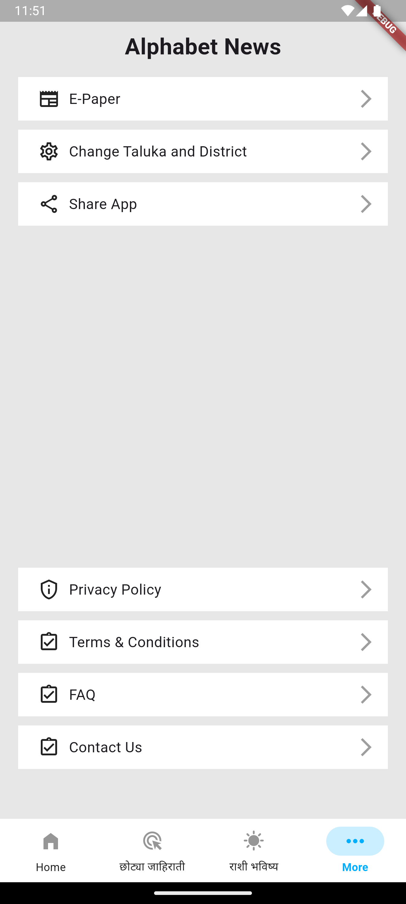
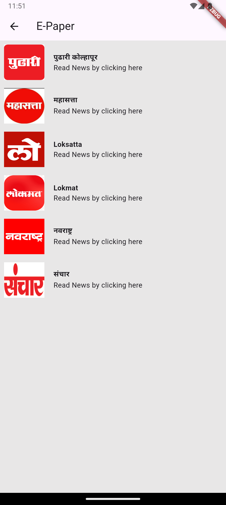

# Alphabet News 📰

A regional news, horoscope, and local classified ads mobile application built using Flutter and Firebase, catering to regional updates (Taluka & District level) in Marathi.

---

## 📱 Features

- **Regional News Feed:** Categorized local, state, and national news updates.
- **Horoscope (राशि भविष्य):** Daily astrological predictions filtered by zodiac sign.
- **Classified Ads (छोट्या जाहिराती):** Local job listings, notices, and promotional banners.
- **E-Paper & News Details:** Integrated webview for full news articles and digital newspaper viewing.
- **Location Selector:** Easily switch between different Talukas and Districts.

---

## 🏗️ Application Flowchart

The overall architecture and navigation flow of the application:


---

## 🛠️ Tech Stack & Tools

- **Framework:** Flutter (Dart)
- **Backend & Database:** Firebase (Cloud Firestore & Firebase Messaging)
- **Monetization:** Google AdMob
- **Architecture / Navigation:** Custom Navigation & Webview Integration

---

## 📸 Screenshots

| Home & News Feed | Regional Content | Ads & Classifieds | Horoscope (राशि भविष्य) | More Options |
| :---: | :---: | :---: | :---: | :---: |
|  |  |  |  |  |

---

## 🚀 Getting Started (Setup & Installation)

Follow these instructions to clone, set up, and run the project on your local machine.

### 📋 Prerequisites

Before running the project, ensure you have the following installed:
- **Flutter SDK:** Version `3.x.x` (Recommended stable release)
- **Dart SDK:** (Bundled with Flutter)
- **IDE:** Android Studio or VS Code (with Flutter & Dart extensions)
- **Device:** Android Emulator, iOS Simulator, or a physical device with USB debugging enabled.

---

### ⚙️ How to Clone & Run

1. **Clone the Repository**
```bash
   git clone https://github.com/RamG222/Alphabet-News.git
```

2. Navigate to Project Directory
```bash
    cd Alphabet-News 
```
3. Install Dependencies - Fetch all required packages listed in pubspec.yaml:
```bash
    flutter pub get
```
4. Verify Environment Setup - Ensure all setup checks pass:
```bash
    flutter doctor
```
5. Run the Application - Start the app on your connected device/emulator:
```bash
    flutter run
```
## 📄 License

This project is open-source and available under the MIT License.
